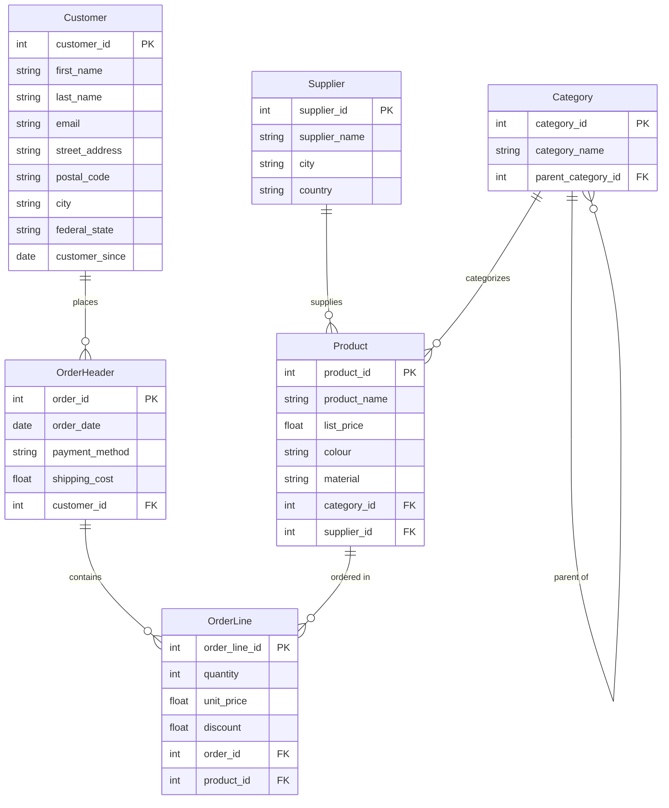
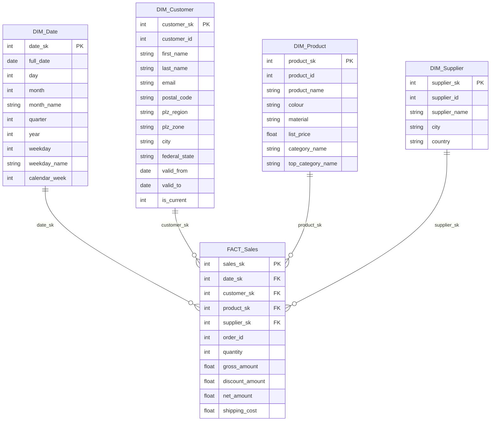

# Project Documentation — Online Furniture Data Warehouse

---

## 1. Business DB (Source System)

### 1.1 Entity-Relationship Diagram



### 1.2 Relational Schema

```
Supplier(supplier_id PK, supplier_name, city, country)

Category(category_id PK, category_name,
         parent_category_id FK → Category)

Product(product_id PK, product_name, list_price, colour, material,
        category_id FK → Category, supplier_id FK → Supplier)

Customer(customer_id PK, first_name, last_name, email, street_address,
         postal_code, city, federal_state, customer_since)

OrderHeader(order_id PK, order_date, payment_method, shipping_cost,
             customer_id FK → Customer)

OrderLine(order_line_id PK, quantity, unit_price, discount,
           order_id FK → OrderHeader, product_id FK → Product)
```

### 1.3 Normal Form Verification

| Form | Check | Result |
|---|---|---|
| **1NF** | Atomic attributes, no repeating groups, single-column PKs | ✅ |
| **2NF** | No partial dependencies (all PKs are surrogates — no composite PK) | ✅ |
| **3NF** | `postal_code → city`? No — city stored independently. `unit_price ≠ list_price` (dynamic pricing). Category attributes separated. | ✅ |

All 6 tables in **3NF**.

### 1.4 Synthetic Data Generation

| Entity | Count | Method |
|---|---|---|
| Supplier | 20 | Hardcoded (10 Germany, 10 neighboring countries) |
| Category | 15 | 5 top-level + 10 sub-categories (hardcoded tree) |
| Product | 120 | Templates × adjectives; price €50–€2,500 random |
| Customer | 5,000 | Faker `de_DE`; email derived from name; PLZ/city from curated CSV |
| OrderHeader | 30,000 | Random dates 2024-01-01 to 2025-12-31; weighted payment methods |
| OrderLine | ~85,500 | 1–5 lines/order; unit_price = list_price ±10%; 80% zero discount |

PLZ accuracy: 1,150 real German postal codes for 75 cities from OpenPLZ API — stored in `data/plz_city_mapping.csv`. Faker's `de_DE` locale does NOT match PLZ ↔ city correctly; curated CSV solves this.

---

## 2. Data Warehouse (Star Schema)

### 2.1 Conceptual Design (mER Diagram)

The mER (multidimensional ER) diagram shows the **conceptual DWH schema**: the central fact table with its measures and the four classification hierarchies. Arrows indicate the roll-up direction (fine → coarse); each chain ends at an implicit **Top** level.


### 2.2 Star Schema Diagram



### 2.3 Grain and Row Counts

Grain: **one row per order line**.

| Table | Rows |
|---|---|
| DIM_Date | 731 (every date in 2024–2025) |
| DIM_Customer | 5,000 |
| DIM_Product | 120 |
| DIM_Supplier | 20 |
| FACT_Sales | ~85,500 |

### 2.4 PLZ Hierarchy in DIM_Customer

| Column | Derivation | Cardinality | Used in |
|---|---|---|---|
| plz_region | `postal_code[0]` | 10 (0–9) | Q2, Q6 |
| plz_zone | `postal_code[:2]` | ~83 | drill-down |
| city | from PLZ mapping CSV | 75 | display |
| federal_state | from PLZ mapping CSV | 16 | Q6 |

---

## 3. SCD Analysis

| Dimension | SCD Type | Changed attributes | Justification |
|---|---|---|---|
| DIM_Date | 0 | — | Dates immutable |
| DIM_Supplier | 0 | — | Supplier identity stable |
| DIM_Product | 1 (overwrite) | product_name, list_price, colour, material | Corrections tolerated; no historical query requires old values |
| DIM_Customer | **2** (expire + insert) | postal_code, street_address, city, federal_state, plz_region, plz_zone | Relocation changes region → historical order assignment matters for Q2/Q6 |

### SCD 2 tracking columns (DIM_Customer)

| Column | Type | Description |
|---|---|---|
| valid_from | DATE | Row start date (customer_since for first load; ETL date on change) |
| valid_to | DATE | Row end date (NULL = active) |
| is_current | INTEGER | 1 = active; 0 = historical |

### SCD 2 ETL logic

```
IF Customer not in DIM_Customer:
    INSERT (valid_from=customer_since, valid_to=NULL, is_current=1)

ELSE IF postal_code OR street_address changed:
    UPDATE current row: valid_to=today, is_current=0
    INSERT new row: valid_from=today, valid_to=NULL, is_current=1

ELSE:
    skip
```

### MSSQL ALTER equivalent (for schema migration reference)

```sql
ALTER TABLE DIM_Customer ADD valid_from  DATE  NOT NULL DEFAULT GETDATE();
ALTER TABLE DIM_Customer ADD valid_to    DATE  NULL;
ALTER TABLE DIM_Customer ADD is_current  BIT   NOT NULL DEFAULT 1;
```

---

## 4. ETL Pipeline

### 4.1 Pipeline Stages

```
Business DB          Stage 1            Stage 2            DWH
(source tables)  →  RAW_ staging   →  FULL_ staging  →  dim_* / fact_*
                   etl_extract.py    etl_transform.py   etl_dim_*.py
                                     sql/transform/     etl_fact_sales.py
```

### 4.2 Stage 1 — Extract (RAW_)

Direct copy from source. No transformation.

| Source | RAW_ table |
|---|---|
| Customer | RAW_BusinessDB_Customer |
| OrderHeader | RAW_BusinessDB_OrderHeader |
| OrderLine | RAW_BusinessDB_OrderLine |
| Product | RAW_BusinessDB_Product |
| Category | RAW_BusinessDB_Category |
| Supplier | RAW_BusinessDB_Supplier |

### 4.3 Stage 2 — Transform (FULL_)

SQL scripts in `sql/transform/`.

| FULL_ table | SQL file | Key transformation |
|---|---|---|
| FULL_BusinessDB_DWH_Customer | 01_FULL_customer.sql | Derive plz_region, plz_zone from postal_code |
| FULL_BusinessDB_DWH_Product | 02_FULL_product.sql | JOIN Category → sub-Category name + top-Category name |
| FULL_BusinessDB_DWH_Sales | 03_FULL_sales.sql | Compute gross, discount_amount, net_amount |

### 4.4 Stage 3 — Load (DWH)

| DWH table | Source | SCD | ETL module |
|---|---|---|---|
| DIM_Date | RAW_OrderHeader.order_date | 0 | etl_dim_date.py |
| DIM_Supplier | RAW_Supplier | 0 | etl_dim_supplier.py |
| DIM_Product | RAW_Product + Category join | 1 | etl_dim_product.py |
| DIM_Customer | RAW_Customer + PLZ derivation | 2 | etl_dim_customer.py |
| FACT_Sales | RAW_OrderLine + header + Product | — | etl_fact_sales.py |

### 4.5 FACT_Sales Column Mapping

| Target | Source | Transform |
|---|---|---|
| date_sk | OrderHeader.order_date | `int(date.replace('-',''))` |
| customer_sk | DIM_Customer.customer_id (is_current=1) | SK lookup |
| product_sk | DIM_Product.product_id | SK lookup |
| supplier_sk | DIM_Supplier.supplier_id | SK lookup |
| order_id | OrderHeader.order_id | Degenerate dimension |
| quantity | OrderLine.quantity | Direct |
| gross_amount | quantity × unit_price | FULL_Sales |
| discount_amount | gross × discount | FULL_Sales |
| net_amount | gross − discount | FULL_Sales |
| shipping_cost | OrderHeader.shipping_cost | Direct |

---

## 5. Storage Calculation

### Business DB

| Table | Rows | Avg row (bytes) | Estimated |
|---|---|---|---|
| Supplier | 20 | 80 | 1.6 KB |
| Category | 15 | 60 | 0.9 KB |
| Product | 120 | 120 | 14.4 KB |
| Customer | 5,000 | 250 | 1.2 MB |
| OrderHeader | 30,000 | 100 | 2.9 MB |
| OrderLine | 85,500 | 60 | 4.9 MB |
| **Subtotal** | | | **~9.0 MB** |

With SQLite overhead (B-tree, indexes, pages): **~11–12 MB**.

### DWH + Staging (additional)

| Layer | Approx. |
|---|---|
| DWH dimensions + FACT_Sales | ~8 MB |
| RAW_ + FULL_ staging | ~12 MB |
| **Total combined DB** | **~30–35 MB** |

---

## 6. Analytical Questions

All SQL in `sql/analytics/`. Run via `python python/run.py` → option 4.

| ID | Question | Dimensions |
|---|---|---|
| Q1 | Revenue and discount per Category and quarter | DIM_Date, DIM_Product |
| Q2a | Average order value by PLZ region | DIM_Customer |
| Q2b | Category mix by PLZ region | DIM_Customer, DIM_Product |
| Q3a | Peak order volume by weekday | DIM_Date |
| Q3b | Top 10 peak calendar weeks | DIM_Date |
| Q4 | Discount effectiveness vs. quantity and revenue | FACT_Sales |
| Q5 | Revenue by price segment (Budget/Mid/Premium) | DIM_Product |
| Q6 | Federal state revenue growth 2024→2025 | DIM_Customer, DIM_Date |
| Q7 | Supplier revenue by quarter and share | DIM_Supplier, DIM_Date |
| Q8 | Supplier discount rate vs. order volume | DIM_Supplier |

**Mandatory for submission:** Q1, Q2 (covers Q2a + Q2b).

**Supplier-specific (extends DIM_Supplier):** Q7, Q8.
