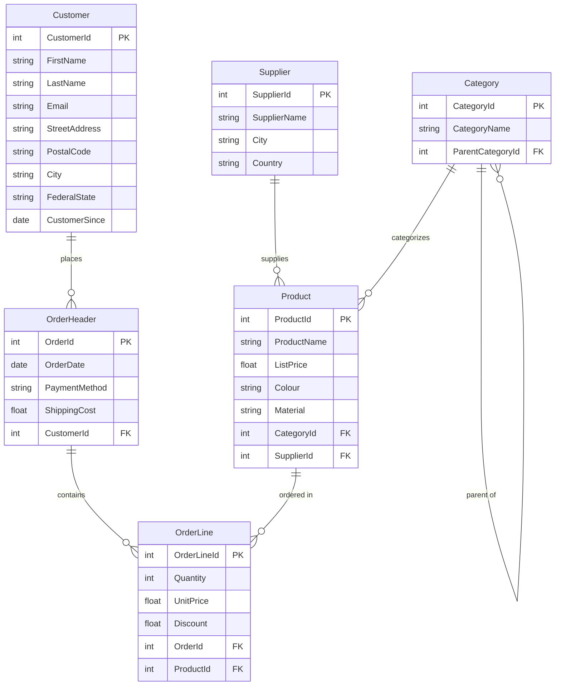
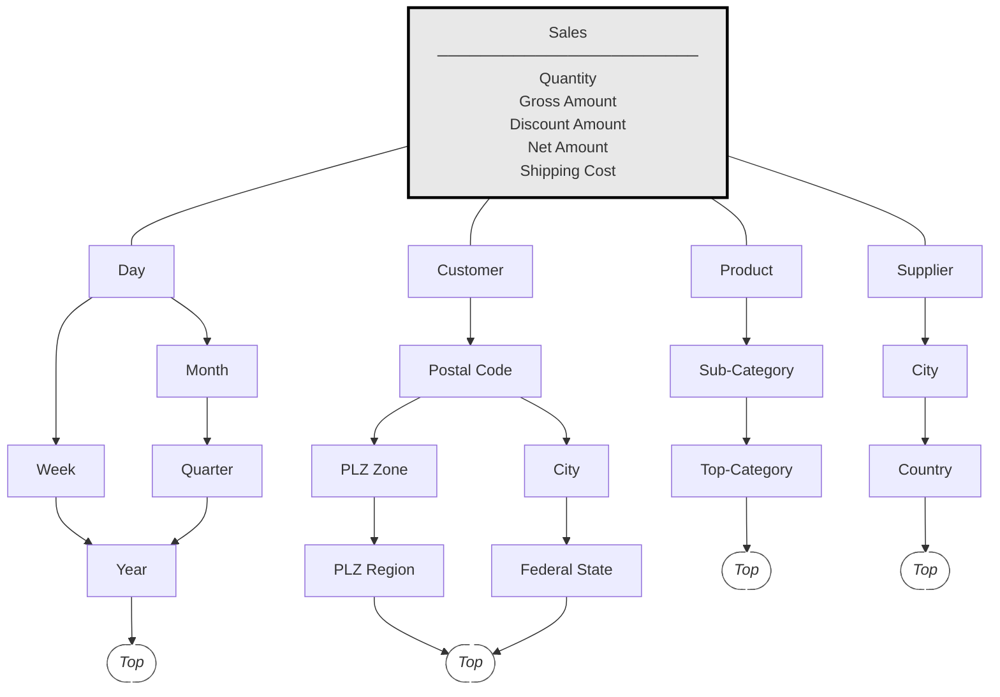
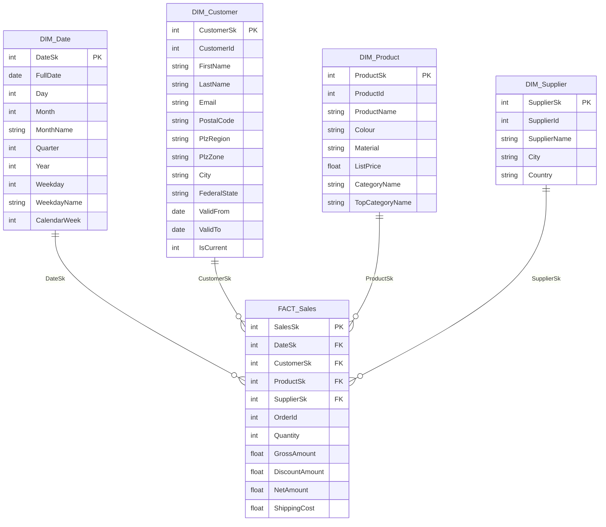

# Project Documentation — Online Furniture Data Warehouse

---

## 1. Business DB (Source System)

### 1.1 Entity-Relationship Diagram



### 1.2 Relational Schema (with Data Types)

```
Supplier(
  SupplierId    INTEGER   PK  AUTOINCREMENT,
  SupplierName  TEXT      NOT NULL  UNIQUE,
  City          TEXT      NOT NULL,
  Country       TEXT      NOT NULL  DEFAULT 'Germany'
)

Category(
  CategoryId        INTEGER   PK  AUTOINCREMENT,
  CategoryName      TEXT      NOT NULL  UNIQUE,
  ParentCategoryId  INTEGER   FK -> Category(CategoryId)  NULL
)

Product(
  ProductId    INTEGER   PK  AUTOINCREMENT,
  ProductName  TEXT      NOT NULL  UNIQUE,
  ListPrice    REAL      NOT NULL  CHECK(>0),
  Colour       TEXT,
  Material     TEXT,
  CategoryId   INTEGER   NOT NULL  FK -> Category(CategoryId),
  SupplierId   INTEGER   NOT NULL  FK -> Supplier(SupplierId)
)

Customer(
  CustomerId     INTEGER   PK  AUTOINCREMENT,
  FirstName      TEXT      NOT NULL,
  LastName       TEXT      NOT NULL,
  Email          TEXT      NOT NULL  UNIQUE,
  StreetAddress  TEXT      NOT NULL,
  PostalCode     TEXT      NOT NULL,
  City           TEXT      NOT NULL,
  FederalState   TEXT      NOT NULL,
  CustomerSince  TEXT      NOT NULL   -- ISO date YYYY-MM-DD
)

OrderHeader(
  OrderId        INTEGER   PK  AUTOINCREMENT,
  OrderDate      TEXT      NOT NULL,  -- ISO date YYYY-MM-DD
  PaymentMethod  TEXT      NOT NULL  CHECK IN ('credit_card','paypal','bank_transfer','invoice'),
  ShippingCost   REAL      NOT NULL  CHECK(>=0),
  CustomerId     INTEGER   NOT NULL  FK -> Customer(CustomerId)
)

OrderLine(
  OrderLineId  INTEGER   PK  AUTOINCREMENT,
  Quantity     INTEGER   NOT NULL  CHECK(>0),
  UnitPrice    REAL      NOT NULL  CHECK(>0),
  Discount     REAL      NOT NULL  CHECK(>=0 AND <1),
  OrderId      INTEGER   NOT NULL  FK -> OrderHeader(OrderId),
  ProductId    INTEGER   NOT NULL  FK -> Product(ProductId)
)
```

### 1.3 Normal Form Verification

| Form | Check | Result |
|---|---|---|
| **1NF** | Atomic attributes, no repeating groups, single-column PKs | ✅ |
| **2NF** | No partial dependencies (all PKs are surrogates — no composite PK) | ✅ |
| **3NF** | `PostalCode → City`? No — City stored independently. `UnitPrice ≠ ListPrice` (dynamic pricing). Category attributes separated. | ✅ |

All 6 tables in **3NF**.

### 1.4 Synthetic Data Generation

| Entity | Count | Method |
|---|---|---|
| Supplier | 20 | Hardcoded (10 Germany, 10 neighboring countries) |
| Category | 15 | 5 top-level + 10 sub-categories (hardcoded tree) |
| Product | 120 | Templates × adjectives; price €50–€2,500 random |
| Customer | 5,000 | Faker `de_DE`; Email derived from name; PLZ/City from curated CSV |
| OrderHeader | 30,000 | Random dates 2024-01-01 to 2025-12-31; weighted payment methods |
| OrderLine | ~85,500 | 1–5 lines/order; UnitPrice = ListPrice ±10%; 80% zero Discount |

PLZ accuracy: 1,150 real German postal codes for 75 cities from OpenPLZ API — stored in `data/plz_city_mapping.csv`. Faker's `de_DE` locale does NOT match PLZ ↔ City correctly; curated CSV solves this.

---

## 2. Data Warehouse (Star Schema)

### 2.1 Conceptual Design (mER Diagram)

The mER (multidimensional ER) diagram shows the **conceptual DWH schema**: the central fact table with its measures and the four classification hierarchies. Arrows indicate the roll-up direction (fine → coarse); each chain ends at an implicit **Top** level.



### 2.2 Star Schema Diagram



### 2.3 Grain and Row Counts

Grain: **one row per order line**.

| Table | Rows |
|---|---|
| DIM_Date | 731 (every date in 2024–2025) |
| DIM_Customer | 5,000 |
| DIM_Product | 120 |
| DIM_Supplier | 20 |
| FACT_Sales | ~85,500 |

### 2.4 PLZ Hierarchy in DIM_Customer

| Column | Derivation | Cardinality | Used in |
|---|---|---|---|
| PlzRegion | `PostalCode[0]` | 10 (0–9) | Q2, Q6 |
| PlzZone | `PostalCode[:2]` | ~83 | drill-down |
| City | from PLZ mapping CSV | 75 | display |
| FederalState | from PLZ mapping CSV | 16 | Q6 |

---

## 2.5 Surrogate vs. Natural Keys (Sk / Id Design)

Every dimension table holds two identifier columns per entity: a **surrogate key** (`*Sk`) and a **natural key** (`*Id`). Both serve distinct purposes:

| Key type | Column example | Generated by | Purpose |
|---|---|---|---|
| **Surrogate key (SK)** | `CustomerSk` | DWH (`AUTOINCREMENT`) | Stable, system-internal join key used by `FACT_Sales`; decoupled from the source system |
| **Natural key (NK)** | `CustomerId` | Source DB (`AUTOINCREMENT`) | Business identifier; enables ETL lookups and traceability back to the source |

### Why both are needed — dimension by dimension

| Dimension | SCD | Requirement |
|---|---|---|
| **DIM_Customer** | 2 | **Strictly required.** Multiple rows can share the same `CustomerId` (one per address version). `CustomerSk` uniquely identifies each version; `CustomerId` is used in SCD 2 lookups (`WHERE CustomerId=? AND IsCurrent=1`). Removing either would break the ETL logic. |
| **DIM_Product** | 1 | **Best practice.** Only one row per `ProductId` (`UNIQUE` constraint). In the current implementation, `ProductSk` and `ProductId` values happen to be identical (both start at 1, both loaded in the same order). However, keeping the surrogate key future-proofs the schema: if the source system is replaced or product IDs are reassigned, the DWH joins remain stable. |
| **DIM_Supplier** | 0 | **Best practice.** Same rationale as DIM_Product. |

### Why Sk = Id in practice (DIM_Product and DIM_Supplier)

Both `ProductSk` and `ProductId` use `AUTOINCREMENT` starting at 1, and all products are loaded in a single sequential batch from the source. The insertion order is identical, so the generated surrogate IDs coincide with the natural keys. This is an implementation coincidence, not a design constraint — the schema does not assume or rely on this equality.

---

## 3. SCD Analysis

| Dimension | SCD Type | Changed attributes | Justification |
|---|---|---|---|
| DIM_Date | 0 | — | Dates immutable |
| DIM_Supplier | 0 | — | Supplier identity stable |
| DIM_Product | 1 (overwrite) | ProductName, ListPrice, Colour, Material | Corrections tolerated; no historical query requires old values |
| DIM_Customer | **2** (expire + insert) | PostalCode, StreetAddress, City, FederalState, PlzRegion, PlzZone | Relocation changes region → historical order assignment matters for Q2/Q6 |

### SCD 2 tracking columns (DIM_Customer)

| Column | Type | Description |
|---|---|---|
| ValidFrom | DATE | Row start date (CustomerSince for first load; ETL date on change) |
| ValidTo | DATE | Row end date (NULL = active) |
| IsCurrent | INTEGER | 1 = active; 0 = historical |

### SCD 2 ETL logic

```
IF Customer not in DIM_Customer:
    INSERT (ValidFrom=CustomerSince, ValidTo=NULL, IsCurrent=1)

ELSE IF PostalCode OR StreetAddress changed:
    UPDATE current row: ValidTo=today, IsCurrent=0
    INSERT new row: ValidFrom=today, ValidTo=NULL, IsCurrent=1

ELSE:
    skip
```

### MSSQL ALTER equivalent (for schema migration reference)

```sql
ALTER TABLE DIM_Customer ADD ValidFrom  DATE  NOT NULL DEFAULT GETDATE();
ALTER TABLE DIM_Customer ADD ValidTo    DATE  NULL;
ALTER TABLE DIM_Customer ADD IsCurrent  BIT   NOT NULL DEFAULT 1;
```

---

## 4. ETL Pipeline

### 4.1 Pipeline Stages

```
Business DB          Stage 1            Stage 2            DWH
(source tables)  →  RAW_ staging   →  FULL_ staging  →  dim_* / fact_*
                   etl_extract.py    etl_transform.py   etl_dim_*.py
                                     sql/transform/     etl_fact_sales.py
```

### 4.2 Stage 1 — Extract (RAW_)

Direct copy from source. No transformation.

| Source | RAW_ table |
|---|---|
| Customer | RAW_BusinessDB_Customer |
| OrderHeader | RAW_BusinessDB_OrderHeader |
| OrderLine | RAW_BusinessDB_OrderLine |
| Product | RAW_BusinessDB_Product |
| Category | RAW_BusinessDB_Category |
| Supplier | RAW_BusinessDB_Supplier |

### 4.3 Stage 2 — Transform (FULL_)

SQL scripts in `sql/transform/`.

| FULL_ table | SQL file | Key transformation |
|---|---|---|
| FULL_BusinessDB_DWH_Customer | 01_FULL_customer.sql | Derive PlzRegion, PlzZone from PostalCode |
| FULL_BusinessDB_DWH_Product | 02_FULL_product.sql | JOIN Category → sub-Category name + top-Category name |
| FULL_BusinessDB_DWH_Sales | 03_FULL_sales.sql | Compute gross, DiscountAmount, NetAmount |

### 4.4 Stage 3 — Load (DWH)

| DWH table | Source | SCD | ETL module |
|---|---|---|---|
| DIM_Date | RAW_OrderHeader.OrderDate | 0 | etl_dim_date.py |
| DIM_Supplier | RAW_Supplier | 0 | etl_dim_supplier.py |
| DIM_Product | RAW_Product + Category join | 1 | etl_dim_product.py |
| DIM_Customer | RAW_Customer + PLZ derivation | 2 | etl_dim_customer.py |
| FACT_Sales | RAW_OrderLine + header + Product | — | etl_fact_sales.py |

### 4.5 FACT_Sales Column Mapping

| Target | Source | Transform |
|---|---|---|
| DateSk | OrderHeader.OrderDate | `int(date.replace('-',''))` |
| CustomerSk | DIM_Customer.CustomerId (IsCurrent=1) | SK lookup |
| ProductSk | DIM_Product.ProductId | SK lookup |
| SupplierSk | DIM_Supplier.SupplierId | SK lookup |
| OrderId | OrderHeader.OrderId | Degenerate dimension |
| Quantity | OrderLine.Quantity | Direct |
| GrossAmount | Quantity × UnitPrice | FULL_Sales |
| DiscountAmount | gross × Discount | FULL_Sales |
| NetAmount | gross − Discount | FULL_Sales |
| ShippingCost | OrderHeader.ShippingCost | Direct |

---

## 5. Storage Calculation

### 5.0 Methodology

**STRING (TEXT) storage in SQLite**

SQLite stores TEXT values using its internal record format. Each TEXT field occupies:

```
bytes_stored = len(string_in_utf8) + varint_bytes_for_type_code
```

- The string content is stored verbatim in UTF-8 (1 byte per ASCII character; 2-4 bytes for non-ASCII)
- A 1–2 byte *serial type code* is prepended in the row header to encode both the type (TEXT) and the length: code = `2 × n + 13` where n is the byte length. For strings up to ~120 characters, this code fits in 1 byte (varint encoding); for 121–240 characters it takes 2 bytes.
- Practical approximation used in the table below: **avg_chars + 2 bytes** (1 byte type code + 1 byte alignment margin).

**INTEGER and REAL storage**

| SQLite type | Storage | Notes |
|---|---|---|
| `INTEGER` (autoincrement PK or FK) | 4–8 bytes | SQLite stores integers in the minimum needed bytes (1–8). For IDs up to ~2 billion: 4 bytes. For safety we use **8 bytes**. |
| `REAL` | Always 8 bytes | IEEE 754 double-precision float |
| `INTEGER NULL` | 0 bytes (if NULL) or 4–8 bytes | NULL is encoded as serial type 0 (zero bytes). Average ~4 bytes assumed for nullable integers. |

**Row overhead (8 bytes)**

Every SQLite row includes a *record header* stored inside the B-tree cell:
- 1 byte: total header length (varint)
- 1 byte per column: serial type code (varint, ~1 byte for our column sizes)
- For a table with 7 columns: ~8 bytes header total

Additionally, each B-tree cell has a ~2-byte entry in the cell pointer array per page. At 4 096 bytes per page and ~60 bytes per row, about 68 rows fit per page, giving ~0.03 bytes/row overhead from cell pointers. This is folded into the 8-byte estimate.

**Conclusion**: the 8-byte overhead approximates the record-header cost for a typical row in our schema (5–9 columns).

### Comparison: Microsoft SQL Server storage

SQL Server uses a different on-disk format. Key differences relevant to this schema:

| Aspect | SQLite | SQL Server |
|---|---|---|
| **Integer** | 1–8 bytes (varint) | `INT` = 4 bytes, `BIGINT` = 8 bytes (fixed) |
| **Float** | 8 bytes | `FLOAT(53)` = 8 bytes, `DECIMAL(p,s)` = 5–17 bytes |
| **String** | `TEXT`: UTF-8, variable | `VARCHAR(n)`: 2-byte length prefix + actual bytes; `NVARCHAR(n)`: 2-byte length + UCS-2 (2 bytes/char) |
| **Row header** | ~8 bytes (varint header) | ~7–10 bytes (status bits, null bitmap, variable-col count) |
| **NULL storage** | 0 bytes (type code 0) | Stored in a null bitmap (1 bit per nullable column, rounded to bytes) |
| **Page size** | 4 KB (SQLite default) | 8 KB (SQL Server default) |

**Practical impact on this schema:**

For columns like `SupplierName` (avg 20 chars):
- SQLite: 20 bytes (UTF-8) + 1 byte type code = ~21 bytes
- SQL Server `VARCHAR(100)`: 20 bytes + 2-byte length prefix = **22 bytes** (similar)
- SQL Server `NVARCHAR(100)`: 40 bytes (UCS-2) + 2-byte length prefix = **42 bytes** (2× larger for Unicode)

For primary keys (`INTEGER` in SQLite → typically `INT` or `BIGINT` in SQL Server):
- SQLite `INTEGER` with ID ≤ 2 billion: 4 bytes (varint)
- SQL Server `INT`: fixed **4 bytes** (slightly more predictable)
- SQL Server `BIGINT`: fixed **8 bytes**

**Estimated SQL Server size for the Business DB:** Using `VARCHAR` (not `NVARCHAR`) and `INT` for IDs, the total storage would be **similar to SQLite** (~7–9 MB for Business DB), since row sizes are comparable. Using `NVARCHAR` would roughly **double** the string storage, increasing Business DB to ~11–14 MB.

---

| Table | Column | Type | Bytes/row |
|---|---|---|---|
| Supplier | SupplierId | INTEGER | 8 |
| | SupplierName | TEXT | ~22 |
| | City | TEXT | ~14 |
| | Country | TEXT | ~12 |
| | Row overhead | | 8 |
| **Supplier total** | | ~64 B/row | 20 rows = **1.3 KB** |
| Category | CategoryId | INTEGER | 8 |
| | CategoryName | TEXT | ~17 |
| | ParentCategoryId | INTEGER (nullable) | 8 |
| | Row overhead | | 8 |
| **Category total** | | ~41 B/row | 15 rows = **0.6 KB** |
| Product | ProductId | INTEGER | 8 |
| | ProductName | TEXT | ~22 |
| | ListPrice | REAL | 8 |
| | Colour | TEXT | ~10 |
| | Material | TEXT | ~12 |
| | CategoryId | INTEGER | 8 |
| | SupplierId | INTEGER | 8 |
| | Row overhead | | 8 |
| **Product total** | | ~84 B/row | 120 rows = **10 KB** |
| Customer | CustomerId | INTEGER | 8 |
| | FirstName | TEXT | ~10 |
| | LastName | TEXT | ~12 |
| | Email | TEXT | ~27 |
| | StreetAddress | TEXT | ~32 |
| | PostalCode | TEXT | 7 |
| | City | TEXT | ~14 |
| | FederalState | TEXT | ~17 |
| | CustomerSince | TEXT | 12 |
| | Row overhead | | 8 |
| **Customer total** | | ~147 B/row | 5,000 rows = **720 KB** |
| OrderHeader | OrderId | INTEGER | 8 |
| | OrderDate | TEXT | 12 |
| | PaymentMethod | TEXT | ~14 |
| | ShippingCost | REAL | 8 |
| | CustomerId | INTEGER | 8 |
| | Row overhead | | 8 |
| **OrderHeader total** | | ~58 B/row | 30,000 rows = **1.7 MB** |
| OrderLine | OrderLineId | INTEGER | 8 |
| | Quantity | INTEGER | 8 |
| | UnitPrice | REAL | 8 |
| | Discount | REAL | 8 |
| | OrderId | INTEGER | 8 |
| | ProductId | INTEGER | 8 |
| | Row overhead | | 8 |
| **OrderLine total** | | ~56 B/row | 85,500 rows = **4.7 MB** |

### 5.2 Business DB Summary

| Table | Rows | Avg row (bytes) | Estimated |
|---|---|---|---|
| Supplier | 20 | 64 | 1.3 KB |
| Category | 15 | 41 | 0.6 KB |
| Product | 120 | 84 | 10 KB |
| Customer | 5,000 | 147 | 720 KB |
| OrderHeader | 30,000 | 58 | 1.7 MB |
| OrderLine | 85,500 | 56 | 4.7 MB |
| **Subtotal** | | | **~7.1 MB** |

With SQLite overhead (B-tree pages, indexes, free pages): **~9–10 MB**.

### 5.3 DWH + Staging (additional)

| Layer | Approx. |
|---|---|
| DWH dimensions + FACT_Sales | ~8 MB |
| RAW_ + FULL_ staging | ~12 MB |
| **Total combined DB** | **~29–30 MB** |

---

## 6. Analytical Questions

All SQL in `sql/analytics/`. Run via `python python/run.py` → option 4.

| ID | Question | Dimensions used |
|---|---|---|
| **Q1** | Revenue and Discount by category over time: *How does net revenue as well as Discounts develop per top-level product category and Quarter?* | DIM_Date, DIM_Product |
| **Q2** | Top 10 PLZ zones by net revenue: *Which 10 postal code zones (first 2 digits of PLZ) generate the maximum net revenue?* | DIM_Customer |
| **Q3** | Top 2 categories per federal state: *What are the two highest net revenue generating product categories per federal state?* | DIM_Customer, DIM_Product |
| **Q4** | Peak order volume by weekday: *Which weekdays see the highest order volume across the two-year period?* | DIM_Date |
| **Q5** | Peak calendar weeks (Top 10): *Which calendar weeks see the highest order volume?* | DIM_Date |
| **Q6** | Revenue by price segment: *How does revenue compare across Budget / Mid-range / Premium product segments?* | DIM_Product |
| **Q7** | Federal state revenue growth: *Which federal states show the strongest revenue growth from 2024 to 2025?* | DIM_Customer, DIM_Date |
| **Q8** | Top 3 suppliers per quarter: *Which 3 suppliers generate the most net revenue per Quarter?* | DIM_Supplier, DIM_Date |
| **Q9** | Supplier Discount behaviour: *Which suppliers' products carry the highest average Discount rate, and does that correlate with order volume?* | DIM_Supplier |

**Mandatory for submission:** Q1, Q2, Q3.

**Supplier-specific (extends DIM_Supplier):** Q8, Q9.
